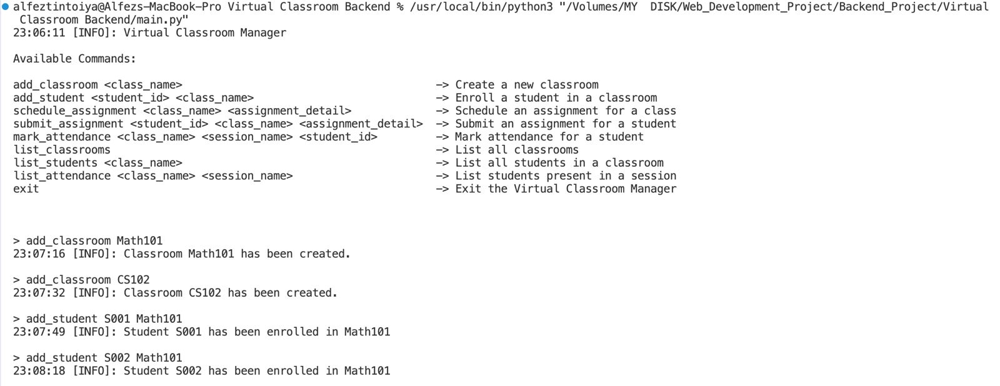
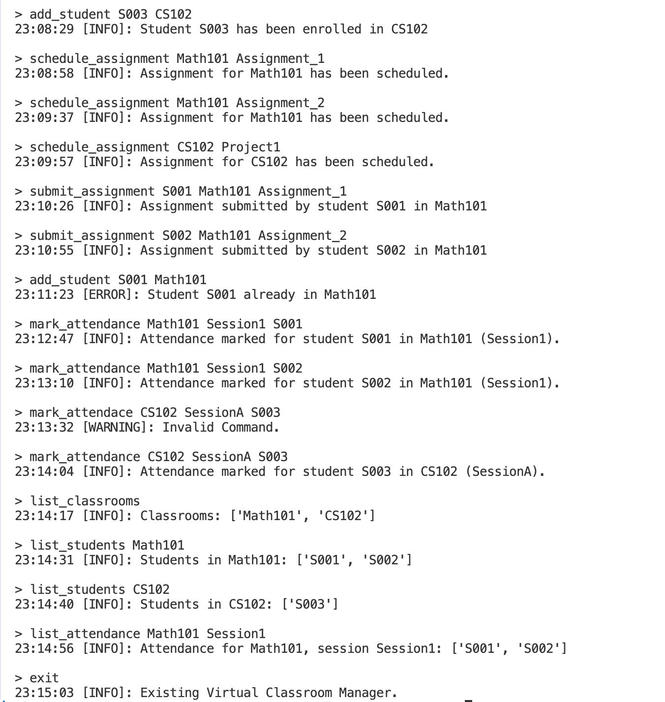

# Virtual Classroom Manager

A simple **command-line based classroom manager** written in Python.  
It allows managing classrooms, students, assignments, and attendance.

---

## 🚀 How to Run

```bash
python main.py
```

Tested Commands Screenshot:

## Commands List



## Tested Commands

